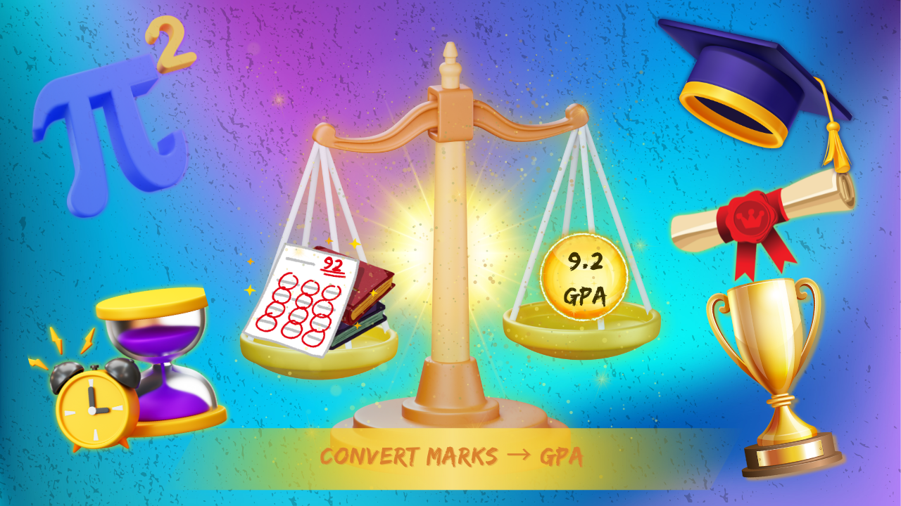

# 🎓 GPA Calculator (Single Subject) — Python + Creative Poster

This project is a simple yet thoughtfully built Python application that takes student marks and converts them into a GPA using clean logic and modular functions.

But this is not just code — it's **visual storytelling**.  
To make the logic feel alive, I’ve also created a **poster using Canva** that visually expresses the transformation:

> Marks (Input) ➝ GPA (Output)  
> Like a glowing balance scale of effort vs achievement ⚖️

---

## 🧠 Features

- Takes student name, subject, and marks  
- Validates input for correct marks  
- Calculates GPA using the formula `marks / 10`  
- Uses modular functions for clarity and reuse  
- Visually expressive poster designed to reflect app logic

---

## 📸 Poster Preview



> Left side shows study efforts and marks.  
> Right side shows GPA, trophy, graduation — powered by Python logic.  
> Designed in Canva using glowing layers, gradients, and storytelling layout.

---

## 🐍 How to Run

Make sure Python is installed. Then:

```bash
python gpa_calculator.py
🛠️ Tech Stack
Python – for logic and app structure

Canva Premium – for poster design

👨‍💻 Author
Yuval Shah

⭐ Like It?
Give this repo a ⭐ if you appreciate the blend of clean logic and creative visual design.
